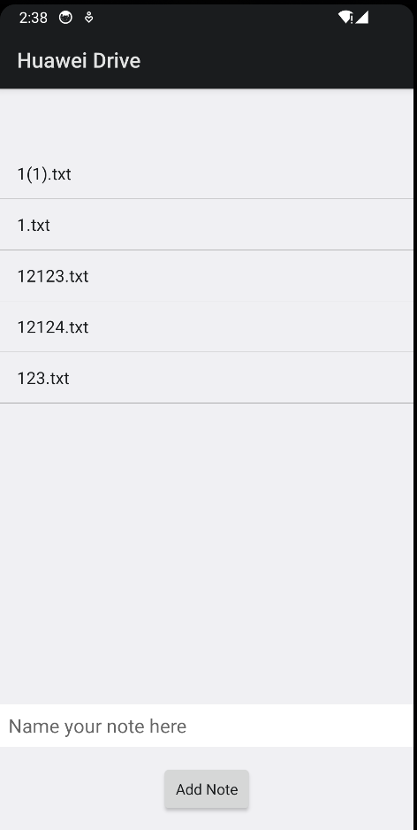
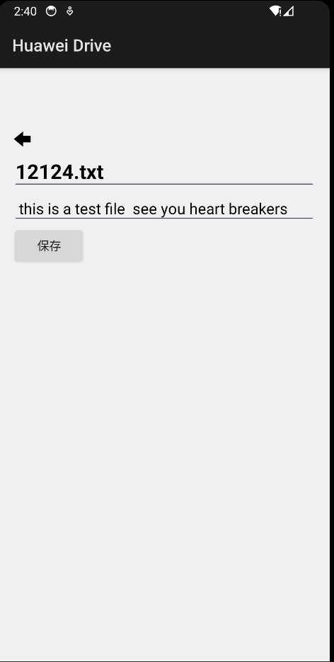

# HMS Drivekit Clientdemo

  

English | [中文](https://github.com/HMS-Core/hms-drive-clientdemo/blob/master/README_ZH.md)

## Introduction   
 This sample code encapsulates APIs of the HUAWEI Drive Kit SDK. It provides many sample programs for your reference or usage. You will learn how to use Drive Kit SDK.   
 The following describes packages of Java sample code.   

### MainPage

 

### DetailPage

 

## Getting Started    

 For more development details, please refer to the following link:   
 https://developer.huawei.com/consumer/en/doc/development/HMSCore-Guides/introduction-0000001050039630   

 Before using HUAWEI Drive Kit SDK sample code, check whether the JAVA environment has been installed.    

 Clone the sample code to local.    
 Take the Android Studio 3.2 version as an example. The steps to run the Drive service sample code are as follows:    
 1. You should create an app in AppGallery Connect, and obtain the file of agconnect-services.json and add to the project.   
 2. You should also generate a signing certificate fingerprint and add the certificate file to the project, and add configuration to build.gradle.   
 See the [Configuring App Information in AppGallery Connect](https://developer.huawei.com/consumer/en/doc/development/HMS-Guides/drivekit-devpreparations) guide to configure app in AppGallery Connect.   
 3. In Android Studio, select "File"->"Open". In the pop-up dialog box, enter the path where the sample code is stored locally, for example: "D:\HuaweiDriveSDK\samples\HuaweiDriveSample-4.0.3.300";
 4. Select the HuaweiDriveSample project to be opened, and then click "OK". In the pop-up dialog box, select "New Window" to open the project in a new window.  
 5. In Android Studio, click "Run", then select your device as the target and click "OK" to launch the sample application on your device.  

## Configuration
 To use functions provided by packages in examples, you do not need to set any related parameters in build.gradle and agconnect-services.json in the app package   
 The following describes parameters in build.gradle and agconnect-services.json   

 applicationId: ID of the application registered on the HUAWEI Developer.   
 app_id: App ID, which is obtained from app information.

 Devices to be tested: Huawei phones running EMUI 10.0 or later or non-Huawei phones running Android 10.0 or later.
 If multiple HMS Core services are used at the same time, the maximum value of each Kit must be used.

## Supported Environments   
 Java 1.8 or a later version is recommended.  
 Android Studio 3.2 version or a later version is recommended.   

 Your application should meet the following conditions:
 minSdkVersion 29 
 targetSdkVersion 33 
 compileSdkVersion 30 
 Gradle 3.5.4 and later.

